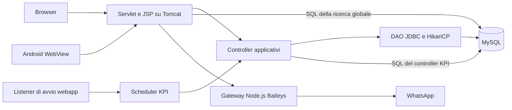

# Fase 1 — Analisi della migrazione Desktop e Android

Data: 28 settembre 2026. Codice di riferimento: commit `a412e3d`.

## 1. Esito

La migrazione è fattibile conservando il database e una parte consistente del codice Java. La strada proposta è un backend Java condiviso, un client Windows installabile e un client Android autonomo. La webapp può convivere con i nuovi client fino al completamento della sostituzione.

La separazione attuale aiuta: esistono già otto controller applicativi e dodici interfacce DAO. L'estrazione richiede però interventi precisi: SQL presente fuori dai DAO, operazioni composte senza una transazione comune, autorizzazioni dipendenti dalle Servlet, logica dei promemoria duplicata e attività periodiche avviate dal container web.

Due applicazioni installabili possono condividere lo stesso database attraverso un backend. Se invece il requisito fosse letteralmente «nessun componente applicativo sul server, soltanto MySQL», sarebbe un'architettura diversa da quella proposta qui. L'accesso SQL diretto obbligherebbe a distribuire accessi al DB e replicare o spostare nel database le regole oggi eseguite sul server.

La scelta della UI Windows resta aperta fra controlli JavaFX e HTML/JavaScript locale in una finestra Java. Per conservare anche l'aspetto del calendario attuale, la seconda possibilità merita un prototipo prima di confermare JavaFX puro.

## 2. Perimetro e attendibilità

Questa è un'analisi statica dei sorgenti, delle configurazioni di esempio e degli script SQL versionati. Sono state esaminate le route, le schermate, i principali flussi di scrittura, il wrapper Android e l'integrazione WhatsApp.

- Nessuna connessione al database reale o al server di produzione.
- Nessuna migrazione eseguita, nessun messaggio WhatsApp inviato.
- Nessuna build applicativa o verifica visuale in esecuzione: Maven non è disponibile nel `PATH` e l'ambiente Android richiede una toolchain compatibile.
- I problemi descritti sono deduzioni dal codice; non sono dichiarazioni di incidenti verificatisi in produzione.
- Schema effettivo, dati storici, volumi, configurazione Tomcat e rete di produzione restano da verificare in un ambiente di test.

L'inventario operativo è in [02-inventario-funzionale.md](02-inventario-funzionale.md). I documenti aggiunti sono l'unica modifica di questa fase.

## 3. Architettura attuale



### Dimensione del codice

| Area | Quantità | Ruolo |
|---|---:|---|
| `controller/application` | 8 file | Casi d'uso e regole applicative |
| `controller/graphic` | 21 file | 18 Servlet, 2 filtri, 1 helper di navigazione |
| `model`, esclusi sottopackage | 18 file | Entità, enum e viste dati |
| `model/dao` | 12 interfacce | Contratti di persistenza |
| `model/dao/database` | 13 file | 12 implementazioni e `ConnectionFactory` |
| Altre classi Java | 21 file | Eccezioni, DTO, utilità, bootstrap, WhatsApp |
| Totale Java | 93 file | Un unico artefatto WAR |
| JSP | 19 file | Comprendono frammenti e una pagina legacy non raggiunta dal routing attuale |
| Tabelle in `db.sql` | 12 | Schema di riferimento versionato |
| Migrazioni SQL | 6 file | Applicazione manuale, senza registro di versione nel codice esaminato |

Il frontend contiene una quota rilevante di comportamento: `calendar.js` ha 1.535 righe; `addressBook.jsp` 864; `dashboardInsights.jsp` 526; `style.css` 2.985. Sono indicatori di complessità, non stime di durata.

### Dipendenze e avvio

Il [pom.xml](../../pom.xml) produce un WAR e dichiara Java source/target 15, Servlet 4.0.1, JSP 2.3.3, JSTL, Jackson 2.17.2, MySQL Connector/J 9.3.0, HikariCP 5.1.0 e jBCrypt 0.4. JUnit 3.8.1 è dichiarato, ma non è presente `src/test` né sono emersi test versionati nella ricognizione.

[ApplicationInitializer](../../src/main/java/it/SimoSW/util/bootstrap/ApplicationInitializer.java) costruisce DAO, controller e servizi con wiring manuale. Non dipende direttamente dalle Servlet: può diventare il punto di composizione del backend.

[ApplicationContextListener](../../src/main/java/it/SimoSW/util/bootstrap/ApplicationContextListener.java) collega invece il ciclo di vita a Tomcat, pubblica le dipendenze nel `ServletContext` e avvia il ricalcolo KPI. Il pool è statico in [ConnectionFactory](../../src/main/java/it/SimoSW/model/dao/database/ConnectionFactory.java); il listener arresta lo scheduler ma non espone una chiusura del pool.

## 4. Riutilizzo ed estrazione

| Componente | Riutilizzo | Lavoro necessario |
|---|---|---|
| Entità, enum, eccezioni | Alto | Separare etichette di presentazione e dipendenze infrastrutturali |
| Controller pazienti, calendario, trattamenti, lista d'attesa | Alto, con revisione | Introdurre identità del chiamante, transazioni e richieste strutturate |
| Autenticazione e approvazione accessi | Parziale | Rendere comuni controlli utente attivo, ruoli, sessioni e atomicità |
| DAO e query MySQL | Alto | Iniettare connessioni/transazioni; preservare query e mapping verificati |
| Controller KPI | Parziale | Estrarre SQL in un contratto dedicato; centralizzare tempo e formule |
| Ricerca globale | Parziale | Spostare SQL e aggregazione dalla Servlet in un servizio |
| Dashboard | Parziale | Estrarre conteggi e riepiloghi dalla Servlet |
| Promemoria | Parziale | Unificare destinatari, template, invio ed esiti oggi distribuiti |
| Servlet, sessioni HTTP, cookie, redirect | Per il client legacy | Aggiungere un adattatore API, mantenendo temporaneamente le route esistenti |
| JSP, CSS, JavaScript | Dipende dalla UI scelta | Ricostruzione in JavaFX o estrazione in frontend locale basato su API |
| Android attuale | Infrastruttura della shell | Non contiene schermate cliniche native né logica gestionale autonoma |

Eccezioni importanti alla separazione già presente:

- [KpiSnapshotController](../../src/main/java/it/SimoSW/controller/application/KpiSnapshotController.java) importa `ConnectionFactory` ed esegue query JDBC direttamente.
- [GlobalSearchServlet](../../src/main/java/it/SimoSW/controller/graphic/GlobalSearchServlet.java) interroga pazienti, appuntamenti e sedute senza un servizio di ricerca intermedio.
- [User](../../src/main/java/it/SimoSW/model/User.java) richiama `PasswordHasher`: spostare semplicemente `model` in un modulo indipendente introdurrebbe una dipendenza verso le utilità di autenticazione. Il modello contiene anche `passwordHash`, che non deve diventare un campo delle risposte API.
- Le interfacce DAO sono collocate sotto `model`, ma possono diventare contratti del livello applicativo. L'implementazione JDBC dovrà dipendere dai contratti, senza creare una dipendenza inversa del dominio verso MySQL.

## 5. Database e semantica dei dati

Fonte: [db.sql](../../src/main/resources/db.sql) e [migrazioni](../../src/main/resources/migrations).

| Gruppo | Tabelle | Relazioni e comportamento |
|---|---|---|
| Accessi | `users`, `access_requests`, `remember_me_tokens` | Ruoli ADMIN/THERAPIST; revisore delle richieste; token collegati all'utente |
| Anagrafica clinica | `patients`, `patient_anamneses`, `patient_conditions` | Paziente condiviso; anamnesi attribuita a un terapista; condizioni associate all'anamnesi |
| Agenda | `appointments` | Terapista obbligatorio; paziente facoltativo; titolo per eventi generici o storico scollegato |
| Trattamenti | `treatment_plans`, `treatment_sessions` | Piano e sedute; collegamento facoltativo all'appuntamento; paziente può diventare nullo |
| Organizzazione | `waitlist_entries`, `therapist_reminder_templates` | Dati specifici del terapista |
| Statistiche | `kpi_monthly_snapshot` | Una riga per ambito, anno e mese; unicità già dichiarata |

### Proprietà e visibilità

`patients` non ha un proprietario terapista. La rubrica normale e la lettura dell'ultima anamnesi non filtrano per terapista. Appuntamenti, lista d'attesa e storico sedute hanno invece filtri specifici. I KPI globali sono accessibili dal flusso del terapista.

Il ruolo ADMIN attuale non equivale a «può aprire qualsiasi schermata clinica»: il filtro permette `/admin/*`, ricerca amministrativa, impostazioni e logout, mentre le altre route protette richiedono THERAPIST. La ricerca amministrativa esegue query globali ma costruisce anche link verso pagine riservate ai terapisti. Questa incoerenza va risolta nella matrice dei permessi, non assunta come nuovo requisito.

### Eliminazione e unione

[DatabasePatientDAO](../../src/main/java/it/SimoSW/model/dao/database/DatabasePatientDAO.java) contiene già transazioni locali per eliminazione e unione dei pazienti.

- L'eliminazione stacca appuntamenti, piani e sedute dal paziente; negli appuntamenti può conservare il nome nel titolo. Non costituisce quindi anonimizzazione completa.
- Secondo lo schema versionato, anamnesi e condizioni vengono eliminate a cascata insieme al paziente. «Conservare lo storico» non significa conservare l'intera scheda clinica.
- L'unione sposta i riferimenti verso il paziente destinazione e rimuove l'origine. Non combina automaticamente tutti i campi anagrafici dei due contatti.
- `patient_id = NULL` rappresenta sia eventi generici sia record il cui paziente è stato eliminato. Un eventuale tipo evento esplicito richiederà una migrazione compatibile con questi dati storici.

### Migrazioni da rendere riproducibili

`db.sql` contiene `DROP DATABASE`: è un bootstrap distruttivo e non va usato per aggiornare un database esistente.

I due script del 13 giugno per la lista d'attesa non formano una sequenza applicabile ciecamente: quello di creazione contiene già `full_name`, mentre quello di conversione aggiunge la stessa colonna e presume `first_name`/`last_name` preesistenti. La data nel nome non basta a stabilire se e come eseguirli.

Occorre fotografare lo schema effettivo, definire una baseline e adottare migrazioni numerate con esiti registrati e verifica delle precondizioni. Le future modifiche dovranno essere inizialmente additive, finché webapp e nuovi client convivono. Il contenitore `START TRANSACTION` non rende annullabili gli `ALTER TABLE`: MySQL documenta i commit impliciti delle operazioni DDL. [Documentazione MySQL](https://dev.mysql.com/doc/refman/8.0/en/implicit-commit.html).

## 6. Problemi concreti da affrontare prima delle nuove scritture

Priorità A: prima di abilitare i nuovi client in scrittura. Priorità B: durante l'estrazione del relativo componente. Nessuna correzione è stata applicata in questa fase.

| Priorità | Evidenza | Conseguenza | Intervento proposto |
|---|---|---|---|
| A | `CalendarServlet.rescheduleAppointment`, `cancelAppointment` e `completeAppointmentAndCreateTreatment` usano un ID senza verificarne il proprietario; i relativi metodi del controller non ricevono il chiamante | Un terapista autenticato può presentare un ID di un altro terapista nei percorsi esaminati | Verifica del proprietario nel caso d'uso, identità ricavata dalla sessione server; test tra due utenti |
| A | Il completamento aggiorna l'appuntamento prima di validare tutti i dati del trattamento | Un titolo mancante o un errore SQL successivo può lasciare l'appuntamento completato senza seduta; anche un evento generico viene aggiornato prima del rifiuto | Validazione iniziale e transazione unica per appuntamento, piano e seduta |
| A | Il controllo delle sovrapposizioni legge e poi inserisce usando chiamate DAO separate | Due richieste simultanee possono superare entrambe il controllo | Serializzare le prenotazioni dello stesso terapista in una transazione; test con intervalli sovrapposti. Un semplice vincolo unico sull'orario iniziale non basta |
| A | Il controllo «trattamento già presente» precede l'inserimento; `appointment_id` non è unico nelle sedute | Richieste ripetute o concorrenti possono creare più trattamenti collegati allo stesso appuntamento | Definire l'unicità richiesta e l'idempotenza; verificare duplicati esistenti prima di introdurre un vincolo |
| A | `AccessRequestController.approve` salva l'utente e aggiorna la richiesta separatamente | L'utente può essere creato mentre la richiesta rimane pendente | Transazione unica e controllo concorrente dello stato PENDING |
| A | Salvataggio profilo, anamnesi e condizioni usa connessioni separate | Possibile salvataggio parziale della scheda | Caso d'uso transazionale; validazione completa prima delle scritture |
| A | Il controllo di utente attivo nel login password è in `LoginPageServlet`, non in `AuthenticationController.authenticate` | Un nuovo adattatore potrebbe autenticare un utente disabilitato se riusasse solo il controller | Portare la regola nel servizio di autenticazione |
| B | SQL nei controller KPI e nella ricerca globale | Estrazione a moduli impossibile senza dipendenze circolari o accessi diretti | Repository di lettura dedicati e DTO espliciti |
| B | Home usa `ChronoUnit.HOURS.between` per ogni appuntamento | Due sedute di 30 minuti sommano zero ore nel calcolo attuale | Sommare minuti e formattare alla fine; registrare la correzione come differenza intenzionale |
| B | KPI combinano snapshot giornalieri e conteggi ricalcolati alla lettura | Uno stesso riepilogo può contenere indicatori aggiornati in momenti diversi | Dichiarare data di aggiornamento e strategia comune; confrontare risultati su fixture |
| B | Cestino esegue la pulizia a 30 giorni nel GET della pagina | L'apertura provoca eliminazioni; senza visite la pulizia non avviene | Separare lettura e manutenzione, mantenendo una policy di conservazione esplicita |
| B | Risoluzione paziente dal solo nome normalizzato | Omonimi ambigui; creazione del paziente precedente alla validazione dell'appuntamento | Selezione tramite ID e comando composto per la creazione rapida |
| B | `LocalDateTime.now()` locale, `Europe/Rome` in alcune Servlet, parsing con rimozione dell'offset | Disallineamenti tra telefono, PC e server | Contratto temporale esplicito, fuso clinica configurato, orologio iniettabile nei test |

Riferimenti principali: [CalendarServlet](../../src/main/java/it/SimoSW/controller/graphic/CalendarServlet.java), [CalendarController](../../src/main/java/it/SimoSW/controller/application/CalendarController.java), [TreatmentController](../../src/main/java/it/SimoSW/controller/application/TreatmentController.java), [AddressBookController](../../src/main/java/it/SimoSW/controller/application/AddressBookController.java), [AddressBookServlet](../../src/main/java/it/SimoSW/controller/graphic/AddressBookServlet.java), [AccessRequestController](../../src/main/java/it/SimoSW/controller/application/AccessRequestController.java), [DashboardServlet](../../src/main/java/it/SimoSW/controller/graphic/DashboardServlet.java).

### Sessioni e contratti API

Il login crea sempre un token persistente quando il salvataggio riesce: non c'è un checkbox «ricordami» nella pagina. I token sono casuali, salvati come hash, con scadenza a 30 giorni; il logout revoca il token corrente. Il login aggiorna gli hash legacy SHA-256 a bcrypt. La configurazione di esempio indica ancora SHA-256, ma quella proprietà non guida l'implementazione esaminata.

Le API dovranno rappresentare l'utente con ID e ruolo, senza hash password. Sessione HTTP con cookie o token opachi sono entrambe opzioni; JWT non è un prerequisito. Vanno definiti scadenza, revoca per dispositivo e disabilitazione degli utenti. Per il legacy sono da verificare anche rotazione dell'ID sessione, protezione CSRF e configurazione effettiva dei cookie: nei sorgenti esaminati non emerge una gestione applicativa dedicata a questi aspetti.

Il filtro attuale redirige al login anche le richieste che aspettano JSON. Il nuovo adattatore dovrà restituire errori strutturati e stati 401/403/409 coerenti, lasciando alla UI la scelta di come presentarli.

## 7. Attività che devono continuare senza la webapp

### KPI

[KpiSnapshotScheduler](../../src/main/java/it/SimoSW/util/bootstrap/KpiSnapshotScheduler.java) aggiorna mese corrente e precedente all'avvio e poi a intervalli fissi di 24 ore, con prima esecuzione calcolata per le 02:30 locali. Non è un cron che ricalcola ogni giorno l'orario nel fuso della clinica: il cambio d'ora merita un test.

Lo scheduler va ospitato sul backend, con un solo esecutore logico se in futuro ci saranno più istanze. Non deve partire su ogni desktop. Il ricalcolo di mesi più vecchi e la conservazione delle metriche dopo cancellazioni restano policy da esplicitare. La capacità di 160 ore mensili per terapista è un valore fisso nel controller.

### WhatsApp

[WhatsAppBaileysService](../../src/main/java/it/SimoSW/service/whatsapp/WhatsAppBaileysService.java) comunica via HTTP col gateway e ne gestisce avvio/arresto attraverso Bash, percorsi Linux e script `.sh`. [server.js](../../baileys-service/server.js) ascolta su `127.0.0.1` e usa una directory di sessione condivisa.

La configurazione permette tutti i terapisti o un terapista specifico, ma non crea un numero WhatsApp distinto per ciascuno. L'architettura proposta conserva il gateway accanto al backend; Desktop e Android chiedono l'invio al backend. Android deve poter lavorare anche a PC spento.

I promemoria sono inviati su azione dell'utente; non è emerso uno scheduler di invio automatico. Template nel DB e sessione Baileys su disco sono due stati persistenti diversi. Non emerge un registro applicativo durevole degli invii: «promemoria da inviare» in home non equivale a «messaggi mai inviati». Prima di introdurre retry automatici occorre definire come prevenire o rendere visibili i duplicati, soprattutto dopo un timeout con esito remoto incerto.

## 8. Struttura proposta

```text
Fisio-e-Sports/
  pom.xml                       aggregatore Maven
  fisio-domain/                 entità e regole indipendenti da UI e DB
  fisio-application/            casi d'uso, contratti DAO/gateway, autorizzazioni
  fisio-persistence-mysql/      query JDBC e gestione transazioni
  fisio-api-contract/           DTO pubblici e specifica API, senza segreti
  fisio-backend/                adattatore HTTP, wiring, scheduler, Baileys
  fisio-web-legacy/             Servlet/JSP e adattatori durante la transizione
  fisio-desktop/                UI Java e client HTTPS
  android-app/                  UI Android e client HTTPS
  baileys-service/              gateway centralizzato
  db/migrations/                baseline e migrazioni gestite
  docs/architecture/            decisioni e criteri di parità
```

È una destinazione proposta, non una struttura già creata. Nella prima estrazione si possono accorpare moduli piccoli; la separazione Maven non impone di introdurre subito il sistema di moduli JPMS.

Dipendenze ammesse:

- `application` dipende da `domain`; dichiara le operazioni di persistenza e invio richieste.
- `persistence-mysql` implementa quei contratti; `backend` compone implementazioni e servizi.
- `desktop` e Android dipendono dai contratti pubblici e dall'API, senza DAO JDBC né credenziali MySQL.
- I client condividono regole tramite il backend. La condivisione di uno stesso JAR con Android è opzionale e richiede compatibilità di bytecode e librerie; una specifica API comune è sufficiente.

Durante la transizione, API e route legacy possono vivere nello stesso deployment Tomcat e usare gli stessi servizi. Questo evita due implementazioni delle regole e due scheduler. Il backend autonomo può essere estratto successivamente. Non è necessario introdurre microservizi, cambiare database o scegliere subito un nuovo framework server.

Famiglie API candidate: accessi/sessioni, richieste amministrative, pazienti/anamnesi, appuntamenti/cestino, trattamenti, lista d'attesa, dashboard/KPI, ricerca, template/promemoria e stato WhatsApp. Il contratto deve specificare permessi, paginazione, date, errori, conflitti di modifica e compatibilità fra versioni. Gli ID terapista inviati dal client non saranno la fonte dell'autorizzazione.

## 9. UI Windows: scelta da validare

| Opzione | Riutilizzo UI | Impatto sulla richiesta di identità |
|---|---|---|
| JavaFX con controlli desktop | Logo, colori, testi e specifica funzionale; schermate da implementare | Buona integrazione desktop, ma calendario, grafici e CSS vanno ricostruiti; identità grafica da verificare |
| Applicazione Java con frontend HTML/JS locale | Parte importante di CSS e comportamento JS; JSP da convertire in viste alimentate da API | Candidata se la fedeltà al calendario attuale pesa molto; richiede prove del motore web, navigazione e bridge |
| Finestra desktop che carica la webapp remota | Molto alto | Soluzione transitoria; continua a dipendere dalle JSP e non completa la loro dismissione |

JavaFX offre un `WebEngine` con rendering web e interazione Java/JavaScript. Questo rende possibile un prototipo ibrido, ma non dimostra da solo la compatibilità con tutti gli asset attuali. [Documentazione OpenJFX](https://openjfx.io/javadoc/24/javafx.web/javafx/scene/web/WebEngine.html).

FullCalendar 6.1.11, Bootstrap 5.3.2 e Chart.js 4.4.3 sono caricati da CDN nel codice attuale. Un frontend locale dovrà includere gli asset necessari, convertire l'iniezione di dati JSP e sostituire i riferimenti al contesto web con chiamate API. Questo può eliminare la webapp JSP sul server pur mantenendo tecnologie web nella UI dei client.

La precedente raccomandazione di JavaFX puro è quindi preliminare. Il criterio di scelta sarà una prova del calendario e della scheda paziente: elementi, azioni, tastiera, leggibilità, DPI, tempi di apertura e comportamento agli errori. «Stessi elementi» non autorizza a eliminare campi o semplificare flussi.

## 10. EXE, installer e ambiente di sviluppo

`jpackage` può produrre installer Windows EXE/MSI e includere un runtime Java. La distribuzione portabile è normalmente una cartella con launcher `.exe`, librerie e runtime, eventualmente compressa in ZIP; non va promessa come singolo EXE autonomo. La creazione del pacchetto Windows avviene su Windows. [Documentazione Oracle](https://docs.oracle.com/en/java/javase/25/docs/specs/man/jpackage.html).

L'applicazione installerà la UI; configurazione, log e stato utente dovranno risiedere in una directory utente separata dai binari. Aggiornamento, firma del pacchetto, architetture Windows supportate e gestione della versione minima API saranno definiti nella fase di distribuzione.

Ambiente osservato:

- Java e `javac` 26.0.2.1 disponibili; `jpackage.exe` presente nella directory del JDK, ma non nel `PATH` rilevato.
- Maven e Gradle non risolti dal `PATH`; nessun Maven Wrapper versionato.
- Android include script e JAR del Gradle Wrapper, versione 8.9, plugin Android 8.5.2, Kotlin 1.9.24; richiede nel progetto Java 17 e SDK 35.
- Gradle 8.9 non supporta l'esecuzione su Java 26: selezionare un JDK compatibile per questa build, per esempio il JDK 17 previsto dal README. Non serve aggiornare tutta la toolchain per avviare l'analisi. [Matrice ufficiale Gradle](https://docs.gradle.org/current/userguide/compatibility.html).
- Node e npm presenti. Android SDK, firma Android, toolchain installer Windows e build pulita non sono stati convalidati. `adb` e i comandi WiX cercati non sono nel `PATH`; ciò non prova che i prodotti siano assenti dal computer.

La disponibilità del wrapper Android, da sola, non dimostra quindi che l'APK sia già compilabile in questo ambiente.

## 11. Piano incrementale e criteri di uscita

| Passo | Risultato concreto | Condizione per passare oltre |
|---|---|---|
| 1. Analisi — questa fase | Architettura attuale, inventario, rischi e proposta | Documenti coerenti col repository; incognite dichiarate |
| 2. Baseline riproducibile | Build web e Android, toolchain fissate, DB isolato con dati sintetici | Build da checkout pulito; login e flussi principali riproducibili; nessun accesso ai dati reali necessario |
| 3. Test ed estrazione del nucleo | Servizi, contratti, persistenza e adattatori legacy separati | Test su permessi, errori parziali, concorrenza e regressioni; webapp ancora utilizzabile |
| 4. API condivise | Autenticazione e contratti per i casi d'uso censiti | Un chiamante senza UI può eseguire i flussi con i permessi corretti; risposte prive di hash e segreti |
| 5. Prototipo e scelta UI | Calendario e scheda paziente confrontabili con la versione attuale | Parità degli elementi approvata su dati sintetici; decisione JavaFX puro/ibrido documentata |
| 6. Desktop completo | Client Windows e primo pacchetto installabile | Copertura dell'inventario, gestione disconnessioni, installazione su PC di prova senza JDK |
| 7. Android autonomo | UI e navigazione indipendenti dalle JSP remote | Stesse operazioni sullo stesso backend; funziona a desktop spento; firma e aggiornamento definiti |
| 8. Dismissione web | Rimozione delle pagine e route legacy | Nessun client dipende dalle JSP; scheduler e WhatsApp operativi; ripristino del deployment precedente provato |

Un prototipo UI con dati fittizi può anticipare la fase API per risolvere subito il dubbio grafico. Non deve accedere direttamente al DB per accelerare la prova.

Le correzioni del comportamento esistente vanno identificate separatamente dalle modifiche puramente strutturali: prima un test che descrive il difetto, poi la correzione e il criterio atteso. Questo rende distinguibili regressioni e miglioramenti voluti.

### Verifiche prioritarie

1. Terapista A non modifica appuntamenti o lista d'attesa di B; accessi ADMIN conformi alla matrice decisa.
2. Fallimento in ciascuna scrittura di completamento, approvazione e anamnesi: nessun risultato parziale.
3. Due prenotazioni concorrenti sulla stessa fascia e due completamenti dello stesso appuntamento: esito deterministico senza duplicati.
4. Eliminazione/unione preservano esattamente i riferimenti previsti, con controlli su anamnesi e record senza paziente.
5. KPI verificati con mesi vuoti, appuntamenti da 15/30/60 minuti, cancellazioni e confini di mese/fuso.
6. Promemoria con telefono assente, esito parziale e timeout ambiguo, usando un gateway simulato.
7. Convivenza web/Desktop/Android su DB di test e versioni diverse del client; conflitti mostrati all'utente.
8. Disinstallazione e aggiornamento desktop non perdono configurazione; l'installer non applica migrazioni al DB.

## 12. Decisioni di prodotto ancora aperte

- Fedeltà UI: stessi campi e azioni oppure anche aspetto/layout del calendario il più possibile identico? È la prima scelta da chiarire prima del prototipo.
- Visibilità: confermare rubrica clinica condivisa e KPI globali per terapisti; definire le reali funzioni amministrative.
- Connettività: ipotesi di lavoro online con API sempre raggiungibile. Installabilità non implica funzionamento offline; offline richiederebbe cache locale e sincronizzazione progettate separatamente.
- Uso operativo: numero di PC e utenti simultanei, versioni Windows, accesso da fuori studio, modalità di distribuzione Android.
- WhatsApp: mantenere un numero/sessione centrale oppure introdurre più account, che sarebbe una funzione nuova.

Queste decisioni non impediscono la fase di baseline e l'estrazione delle responsabilità già individuate. Servono prima di rendere definitive UI, permessi e distribuzione.
