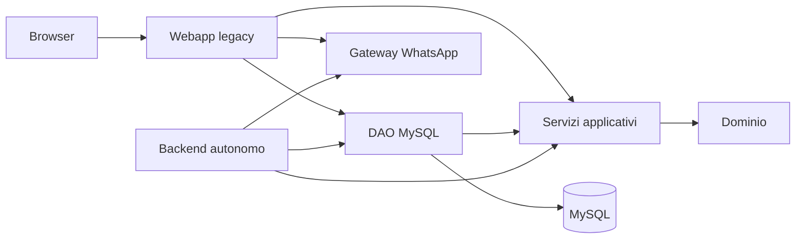

# Struttura dei componenti

## Moduli Java

| Modulo | Contenuto | Dipende da |
|---|---|---|
| `fisio-domain` | Entità, enum ed eccezioni | Solo JDK |
| `fisio-application` | Casi d'uso, contratti DAO e hashing password | `fisio-domain`, jBCrypt |
| `fisio-persistence-mysql` | DAO JDBC, pool e lettura configurazione | `fisio-application`, MySQL Connector/J, HikariCP |
| `fisio-web-legacy` | Servlet, JSP, bootstrap e integrazione WhatsApp | `fisio-persistence-mysql` e dipendenze web |
| `fisio-backend` | Processo HTTP autonomo, salute DB, API e scheduler KPI | `fisio-persistence-mysql`, Jackson per la risposta del gateway |
| `fisio-desktop` | Prototipo di interfaccia HTML/JavaScript locale in JavaFX WebView | JavaFX Web |

Il `pom.xml` alla radice è l'aggregatore Maven. La webapp produce ancora
`Fisio-e-Sports.war`; il nome del contesto Tomcat non cambia. Le classi
mantengono per ora i package Java originali per evitare rinominazioni estranee
alla separazione. Il backend usa i servizi condivisi per autenticare il
terapista, leggere i suoi appuntamenti e pazienti e gestire la sua lista d'attesa.

`KpiSnapshotController` è condiviso in `fisio-application`; le query SQL sono
nel `DatabaseKpiMetricsDAO` tramite il contratto `KpiMetricsDAO`. Lo scheduler
KPI gira solo nel backend autonomo: aggiorna il mese corrente e il precedente
all'avvio, poi ogni 24 ore con prima esecuzione alle 02:30 locali. La webapp legacy continua a leggere gli
stessi snapshot senza avviare un secondo scheduler.

## Flusso attuale

Il desktop parte dal login e usa le API del backend per calendario, pazienti,
trattamenti, anteprima e invio promemoria. Android usa ancora la webapp tramite
WebView. I client non accedono direttamente a MySQL.
Sul server Baileys gira come `fisio-baileys.service` con sessione privata in
`/var/lib/fisio-baileys`; il backend ne legge stato e QR senza gestire il
processo. In locale è disponibile la modalità manuale per Avvia/Arresta.
