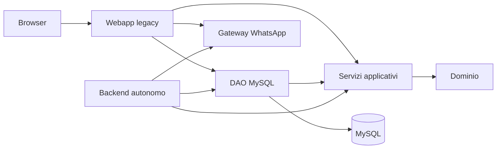

# Struttura dei componenti

## Moduli Java

| Modulo | Contenuto | Dipende da |
|---|---|---|
| `fisio-domain` | Entità, enum ed eccezioni | Solo JDK |
| `fisio-application` | Casi d'uso, contratti DAO e hashing password | `fisio-domain`, jBCrypt |
| `fisio-persistence-mysql` | DAO JDBC, pool e lettura configurazione | `fisio-application`, MySQL Connector/J, HikariCP |
| `fisio-web-legacy` | Servlet, JSP, bootstrap, KPI e integrazione WhatsApp | `fisio-persistence-mysql` e dipendenze web |
| `fisio-backend` | Processo HTTP autonomo, salute DB e API per identità, calendario, trattamenti, promemoria e rubrica | `fisio-persistence-mysql`, Jackson per la risposta del gateway |
| `fisio-desktop` | Prototipo di interfaccia HTML/JavaScript locale in JavaFX WebView | JavaFX Web |

Il `pom.xml` alla radice è l'aggregatore Maven. La webapp produce ancora
`Fisio-e-Sports.war`; il nome del contesto Tomcat non cambia. Le classi
mantengono per ora i package Java originali per evitare rinominazioni estranee
alla separazione. Il backend usa i servizi condivisi per autenticare il
terapista, leggere i suoi appuntamenti e pazienti e gestire la sua lista d'attesa.

`KpiSnapshotController` rimane in `fisio-web-legacy` perché esegue ancora SQL
diretto tramite `ConnectionFactory`. Per spostarlo in `fisio-application` occorre
prima estrarre le sue query in un contratto di lettura. Il bootstrap e lo
scheduler sono ancora legati al ciclo di vita Tomcat. La webapp e il backend
autonomo non vanno avviati come due scheduler KPI indipendenti.

## Flusso attuale

Il desktop parte dal login e usa le API del backend per calendario, pazienti,
trattamenti, anteprima e invio promemoria. Android usa ancora la webapp tramite
WebView. I client non accedono direttamente a MySQL.
